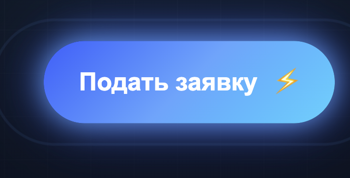
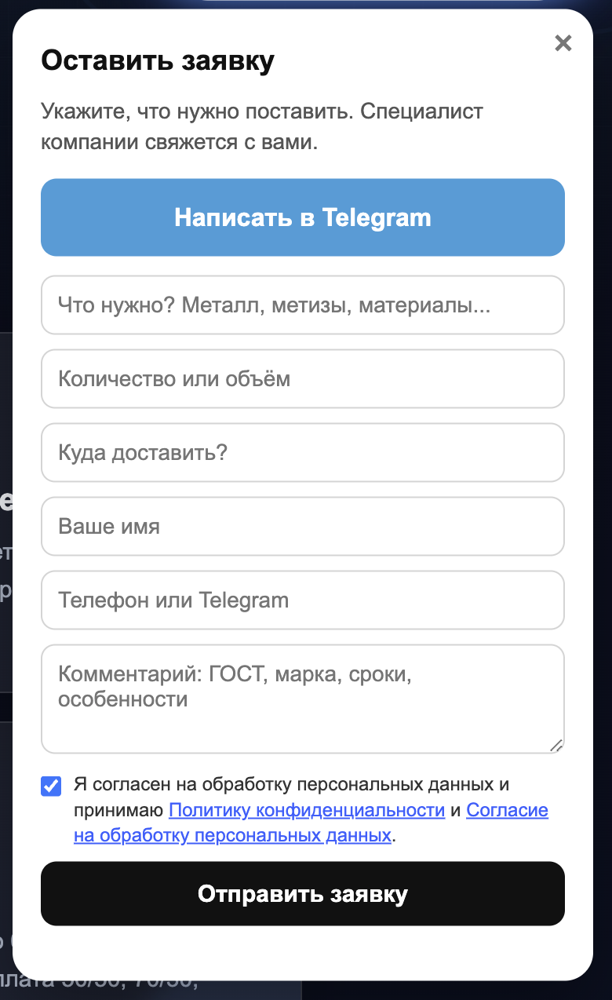
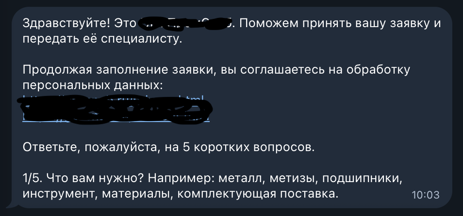
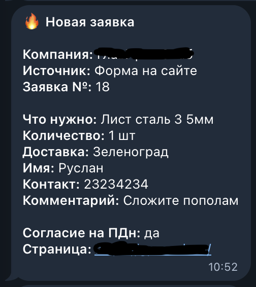
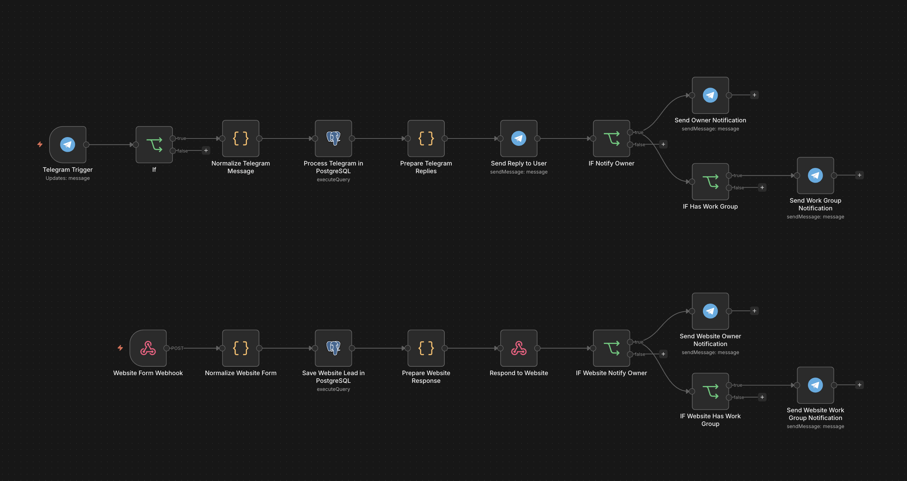
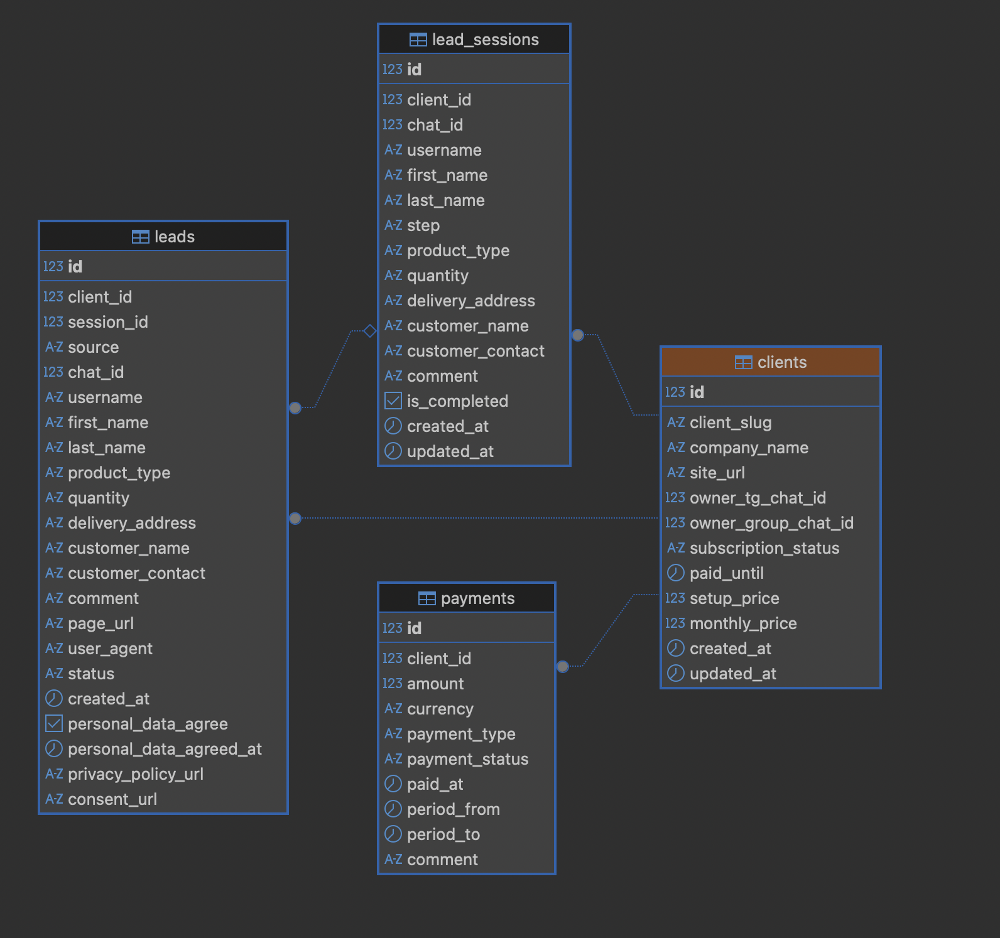

# 🚀 Telegram Lead Capture System

A simple **n8n + PostgreSQL + Telegram** automation for capturing website leads and sending them directly to a manager or Telegram group.

## 🇬🇧 Short Description

**Telegram Lead Capture System** is an automation template for capturing leads from a website form and Telegram bot.

The system can:

- receive leads from a website form;
- start a Telegram bot from a website button;
- ask the customer several short questions;
- save the lead into PostgreSQL;
- notify the owner or a Telegram manager group;
- scale one system across multiple clients and websites.

This project is useful for **B2B, services, manufacturing, supply companies, construction businesses, local services**, and any business that needs fast lead handling.

---

## 🇷🇺 Краткое описание

**Telegram Lead Capture System** — это шаблон автоматизации для приёма заявок с сайта и Telegram-бота.

Система позволяет:

- принимать заявки через форму на сайте;
- запускать Telegram-бота по кнопке на сайте;
- задавать клиенту короткие вопросы;
- сохранять заявку в PostgreSQL;
- отправлять уведомление собственнику или в Telegram-группу менеджеров;
- масштабировать одну систему на несколько клиентов / сайтов.

Проект подходит для **B2B, услуг, производства, поставок, строительных компаний, локального бизнеса** и любых ниш, где важно быстро не потерять заявку.

---

## 🖼️ Demo Screenshots

### Website button



### Website lead form



### Telegram bot flow



### Manager notification



### n8n workflow



### PostgreSQL lead storage



More details: [`docs/demo-screenshots.md`](docs/demo-screenshots.md)

---

## 🧩 Architecture

### Website form flow

```text
Website lead form
        ↓
n8n Webhook
        ↓
Normalize website form data
        ↓
PostgreSQL function crm_process_web_lead()
        ↓
Save lead in PostgreSQL
        ↓
Return response to website
        ↓
Send Telegram notification to owner / manager group
```

### Telegram bot flow

```text
Website Telegram button
        ↓
Telegram bot /start client_slug
        ↓
n8n Telegram Trigger
        ↓
Normalize Telegram message
        ↓
PostgreSQL function crm_process_tg_message()
        ↓
Save dialog state / save lead
        ↓
Send reply to customer
        ↓
Send Telegram notification to owner / manager group
```

---

## 🛠️ Tech Stack

- **n8n** — automation workflows
- **PostgreSQL** — lead storage and dialog state
- **Telegram Bot API** — customer communication and manager notifications
- **HTML / CSS / JavaScript** — website widget

---

## 📁 Repository Structure

```text
telegram-lead-capture-system/
├── README.md
├── LICENSE
├── .gitignore
├── .env.example
├── sql/
│   ├── 001_schema.sql
│   ├── 002_functions.sql
│   └── 003_demo_data.sql
├── website/
│   └── lead-widget.html
├── n8n/
│   ├── workflow-notes.md
│   └── workflow-placeholder.json
└── docs/
    ├── architecture.md
    ├── setup-checklist.md
    ├── security.md
    ├── demo-screenshots.md
    └── screenshots/
        ├── 01-website-button.png
        ├── 02-website-form.png
        ├── 03-telegram-bot-flow.png
        ├── 04-manager-notification.png
        ├── 05-n8n-workflow.png
        └── 06-postgresql-leads.png
```

---

## ⚙️ Setup Outline

1. Create a Telegram bot using BotFather.
2. Create a Telegram manager group.
3. Add the bot to the manager group.
4. Create a PostgreSQL database.
5. Run SQL schema.
6. Run SQL functions.
7. Insert demo client.
8. Import or recreate n8n workflow.
9. Add PostgreSQL credentials in n8n.
10. Add Telegram credentials in n8n.
11. Replace webhook URL in website widget.
12. Replace Telegram bot username in website widget.
13. Test website form.
14. Test Telegram bot with `/start demo-client`.
15. Check that leads are saved in PostgreSQL.
16. Check that notifications are sent to Telegram group.

See: [`docs/setup-checklist.md`](docs/setup-checklist.md)

---

## 🔐 Security Notes

Never commit:

- Telegram bot token
- PostgreSQL password
- n8n credentials
- real chat ID values
- private webhook URLs
- real customer data
- real leads
- `.env` files with secrets

Use `.env.example` with demo placeholders instead.

See: [`docs/security.md`](docs/security.md)

---

## 🧪 Demo Placeholders

Use placeholders like:

```text
https://example.com
https://n8n.example.com/webhook/lead-form
@demo_lead_bot
DEMO_OWNER_CHAT_ID
DEMO_GROUP_CHAT_ID
demo-client
demo@example.com
+7 000 000-00-00
```

---

## 📌 Project Tagline

**English:**  
A simple n8n + PostgreSQL + Telegram automation for capturing website leads and sending them directly to a manager group.

**Russian:**  
Простая автоматизация на n8n, PostgreSQL и Telegram для приёма заявок с сайта и отправки их менеджерам в Telegram-группу.
